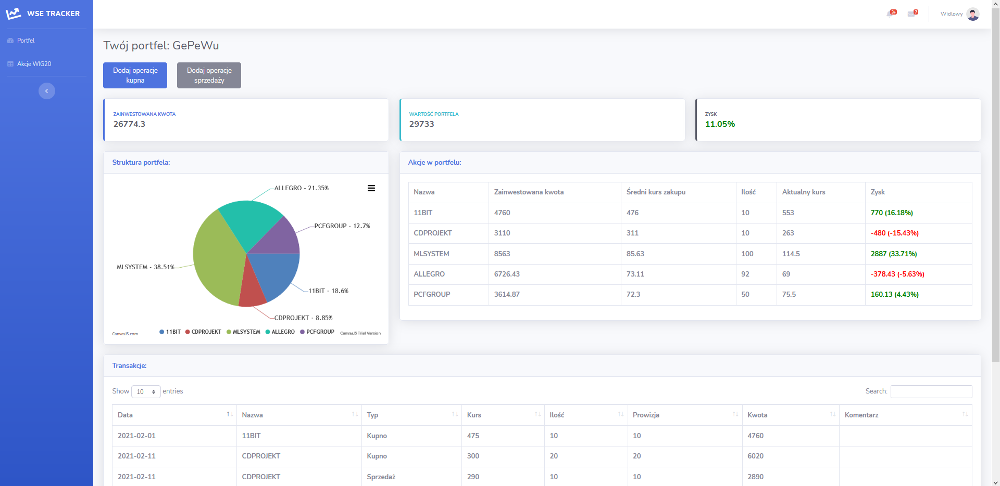

# Warsaw Stock Exchange Tracker

Project for "Creating Internet Apps" at my university built with Laravel PHP Framework.

The application allows you to track your investment portfolio on Warsaw Stock Exchange.
Share price data is retrieved and stored in a database using a python scraper available [here](https://github.com/M1SZ4/stooq-scrape).

## Requirements
* PHP 8
* Laravel 8
* MySQL database

## Features
* User can create multiple wallets
* The application allows you to add shares to your "wallet",
after adding them you have the option to sell (remove all or only part of the shares from the "wallet")
* Portfolio view displays information about your current positions and calculates profit or loss.
    * on top - summary of your wallet (total amount invested, current portfolio value, result in %)
    * below is a chart with the current portfolio structure, and detailed info on every share packet you own
    * below is the history of transactions made on this wallet
* Each transaction is saved in the transaction log.

## Screenshots

